# Smart Leads Dashboard Frontend

A responsive and premium leads management dashboard built as a production-grade MERN stack application interface. This client-side application integrates seamlessly with the Smart Leads backend to provide real-time lead analytics, responsive list management, advanced multi-parameter filtering, search, sorting, role-based authorization, and administrative exports.

---

## Project Overview

The Smart Leads Dashboard Frontend serves as the user-facing application for sales representatives and administrators. It features:
* **Interactive Data Views**: Visual lead status distributions, statistics, and tables with full sorting and pagination.
* **Granular Role Controls**: Role-based access control (RBAC) allowing administrators full permissions (including CSV export and delete actions) and sales representatives restricted operational views.
* **Fluid Dual-Theme Support**: System-matching dynamic dark/light toggling integrated deeply into layouts, cards, and canvas backgrounds.
* **Resilient API Layer**: Complete request intercepting, token auto-injection, silent 401 session expiry redirects, and unified domain error handling.

---

## Features

1. **Authentication Flow**: Complete login and registration forms featuring responsive input components, real-time client-side schema validation (via React Hook Form + Zod), persistent tokens, and secure routing.
2. **Lead Management Features**: Modal-driven creation and inline updates of lead records, covering properties like Full Name, Email, Status, and Source.
3. **Filtering and Pagination**: Multi-criteria client-side search query, lead status dropdown, lead source dropdown, and custom date sorting which dynamically reflect in URL SearchParams for state preservation.
4. **CSV Export**: Secure admin-only trigger requesting backend CSV compilation and direct client-side stream downloading.
5. **Responsive Design**: Mobile-responsive sidebar layouts, adaptive tables, fluid flex grids, and soft interactive canvas dots adjusting to window resizing.

---

## Tech Stack

* **Core UI**: React 19, TypeScript
* **Routing**: React Router DOM (v7)
* **Styling**: Tailwind CSS (v4), class-variance-authority, clsx
* **Form & Validation**: React Hook Form, Zod, @hookform/resolvers
* **HTTP Client**: Axios (with custom request/response interceptors)
* **Icons & Assets**: Lucide React
* **Build System**: Vite

---

## Folder Structure

```text
src/
├── api/                  # Axios HTTP client instances and global interceptors
│   ├── client.ts         # Base client instantiation
│   └── interceptors.ts   # Token injection and error translation interceptors
├── assets/               # Static assets and brand resources
├── components/           # Reusable UI widgets and layout blocks
│   ├── background/       # Canvas effects (DotField interactive grid)
│   ├── modals/           # Action overlays (LeadFormModal, DeleteLeadModal)
│   ├── states/           # Fallback boundaries (ErrorBoundary)
│   ├── theme/            # Theme configuration (ThemeToggle)
│   └── ui/               # Primary components (Input, Button)
├── constants/            # Configuration constants and keys
├── context/              # Context providers (Auth, Theme, Toast)
├── forms/                # Form validation schemas (Zod models)
├── hooks/                # Custom React hooks (useAuth, useTheme, useToast)
├── layouts/              # Main shells (DashboardLayout, AuthLayout)
├── pages/                # Route pages (Overview, Leads, Login, Register)
├── routes/               # Navigation route tree and route guards
├── types/                # Strict TypeScript interface declarations
└── utils/                # General utility classes (ApiError)
```

---

## Installation Steps

1. **Clone the repository**:
   ```bash
   git clone <repository-url>
   cd servicehive-frontend
   ```

2. **Install dependencies**:
   ```bash
   npm install
   ```

3. **Configure environment variables**:
   Create a `.env` file in the root directory (based on `.env.example`).

4. **Start the development server**:
   ```bash
   npm run dev
   ```

---

## Environment Variables

The project requires the following environment variables. Create a `.env` file in the root folder:

```env
VITE_API_URL=http://localhost:5000/api/v1
```

---

## Running Locally

* To run the application in development mode with Hot Module Replacement (HMR):
  ```bash
  npm run dev
  ```
* To perform a strict TypeScript compilation check and compile the production bundle:
  ```bash
  npm run build
  ```
* To preview the production bundle locally:
  ```bash
  npm run preview
  ```

---

## Deployment and API Information

* **Backend Deployment Link**: `[Backend Deployment Link Placeholder]`
* **Frontend Deployment Link**: `[Frontend Deployment Link Placeholder]`
* **API Base URL**: `http://localhost:5000/api/v1` (local) or `[Production API URL Placeholder]`

---

## Demo Video

*A walkthrough showing user authentication, creating/editing leads, filters, CSV exporting, and dark/light theme switching.*

[► Play Demonstration Video (Google Drive)](https://drive.google.com/drive/folders/1XqiF04SCvQOFAMRYE935xHVs2ApFhFqR?usp=sharing)

---

## Application Screenshots

### Authentication Screenshots
Showcasing the login and registration interfaces.

| Login Page | Register Page |
|:---:|:---:|
| 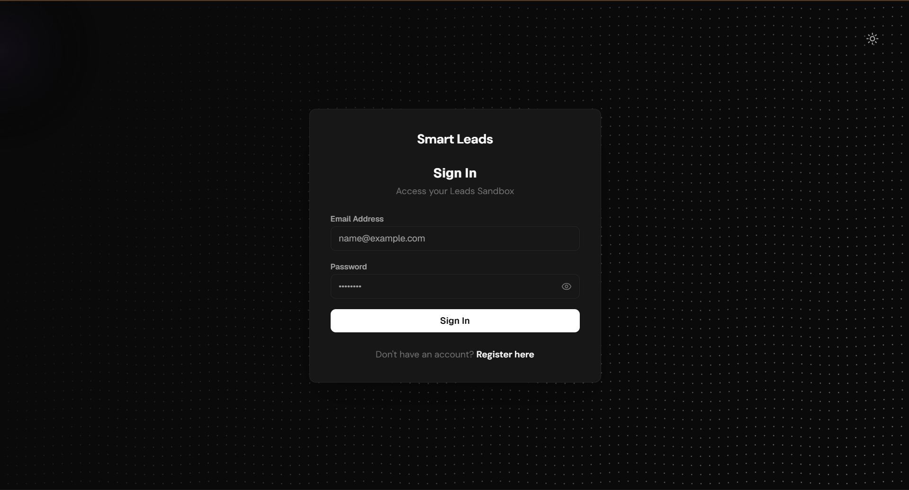 | 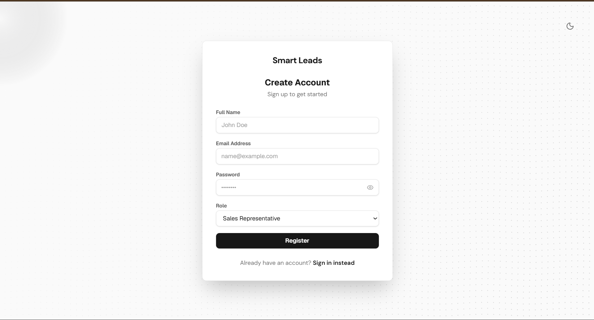 |

### Dashboard Screenshots
An overview of the main statistics dashboard and list views.

#### 1. Overview Dashboard
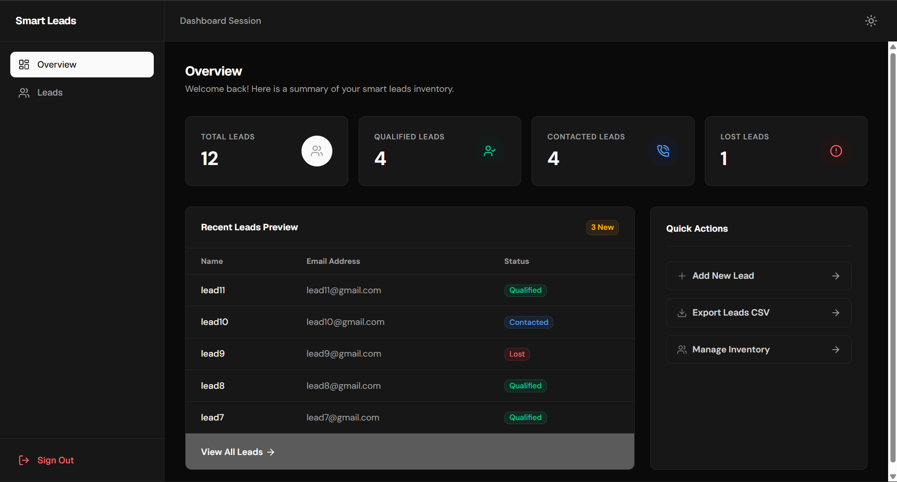

#### 2. Leads Management Board
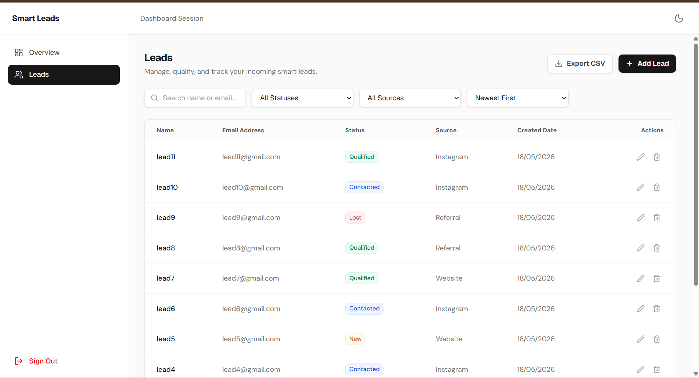

#### 3. Lead Actions & Modal View
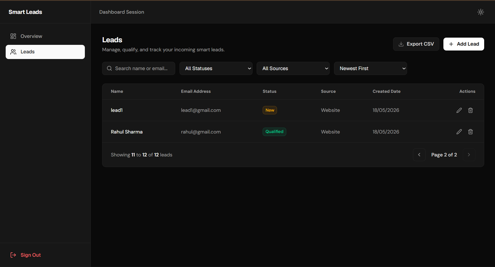

---

## Postman API Testing

Screenshots demonstrating request/response telemetry during MERN integration testing.

#### 1. Authentication - User Login
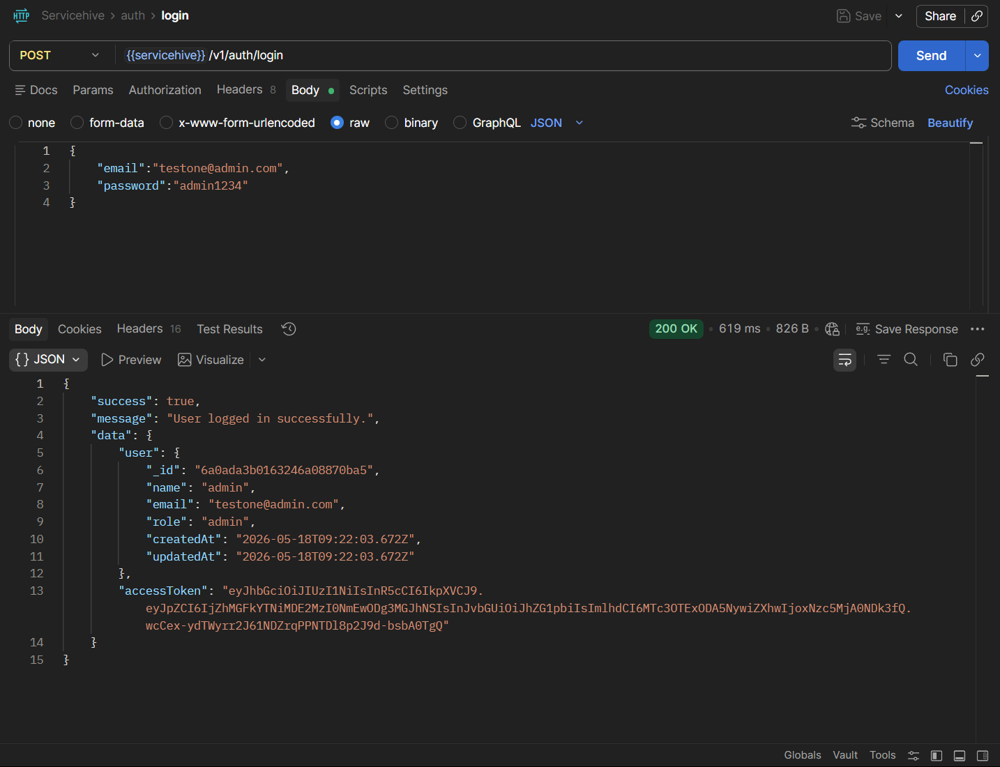

#### 2. Authentication - User Registration
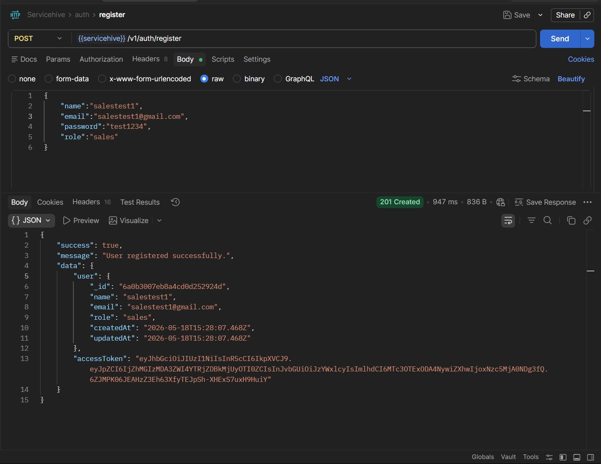

#### 3. Leads - Create New Lead
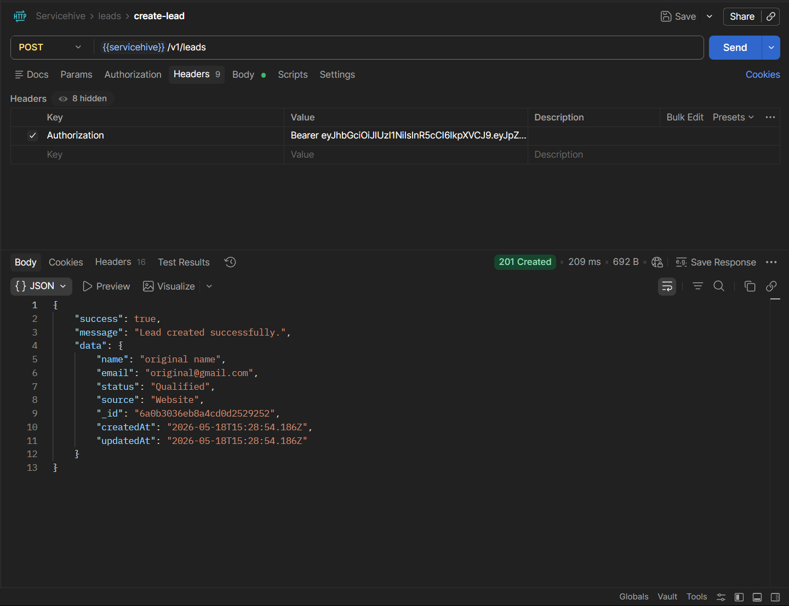

#### 4. Leads - Get Leads (Filtered Search & Pagination)
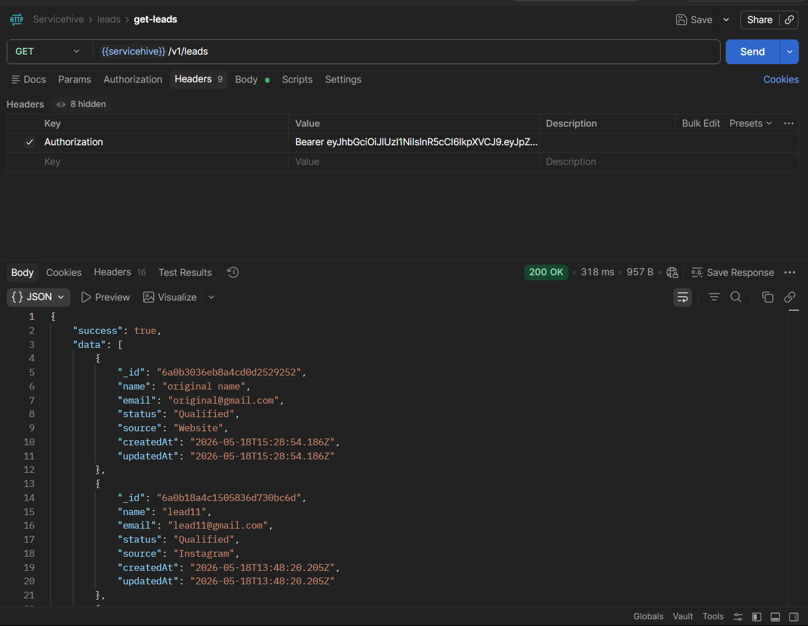

#### 5. Leads - Update Lead
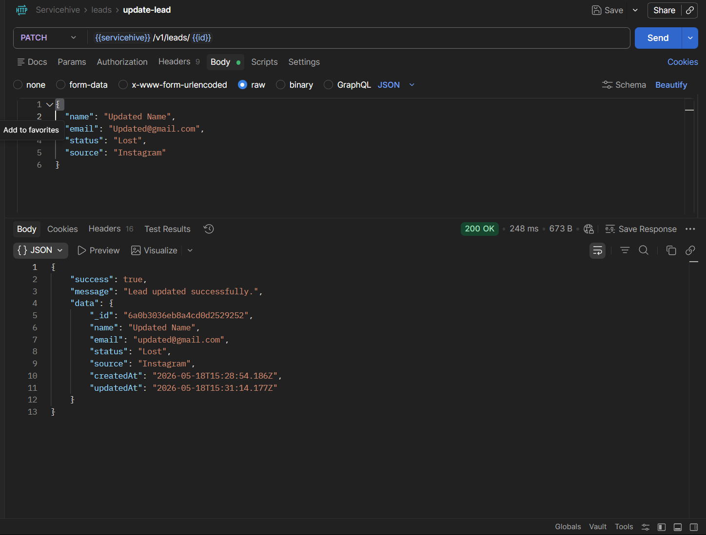

#### 6. Leads - Delete Lead
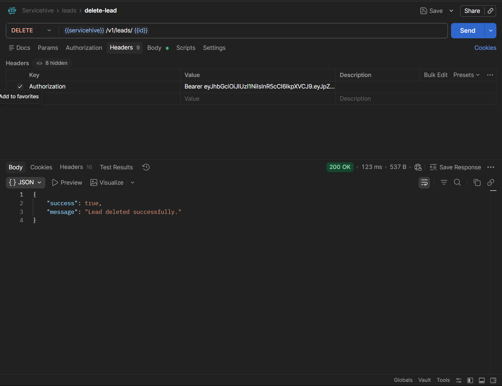

#### 7. Leads - Export Leads CSV
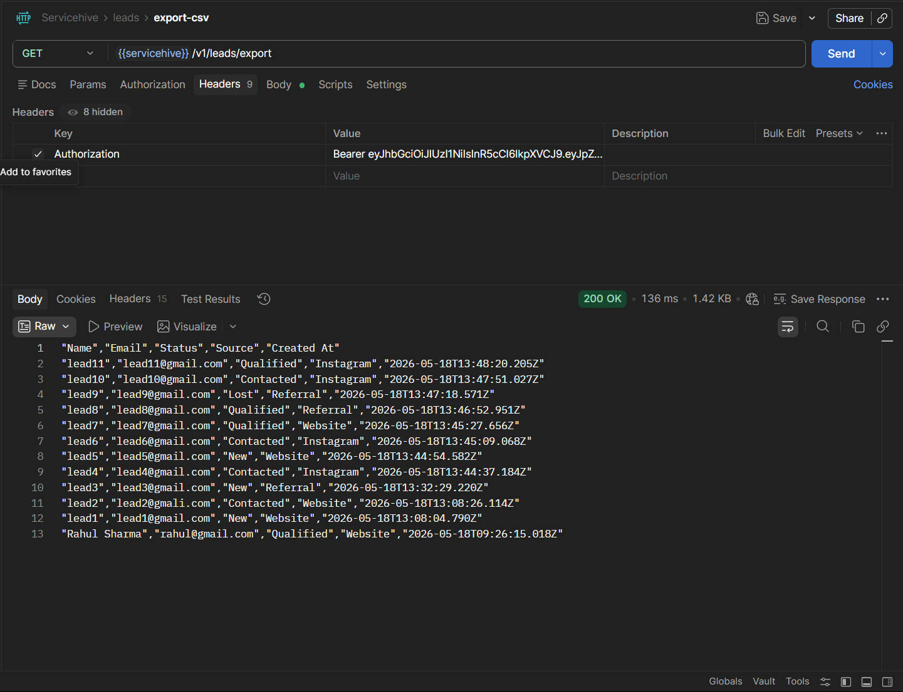

---

## Future Improvements

* **Caching Layer**: Integrate React Query or SWR for automatic state-revalidation and caching of lead statistics.
* **Bulk Import**: Add CSV bulk upload support with client-side mapping interfaces and error rows preview.
* **Export Customization**: Allow columns selection and custom format mapping before CSV triggers.
* **Lead Assignment Engine**: Automatic lead allocation based on rep load or geographic performance.

---
